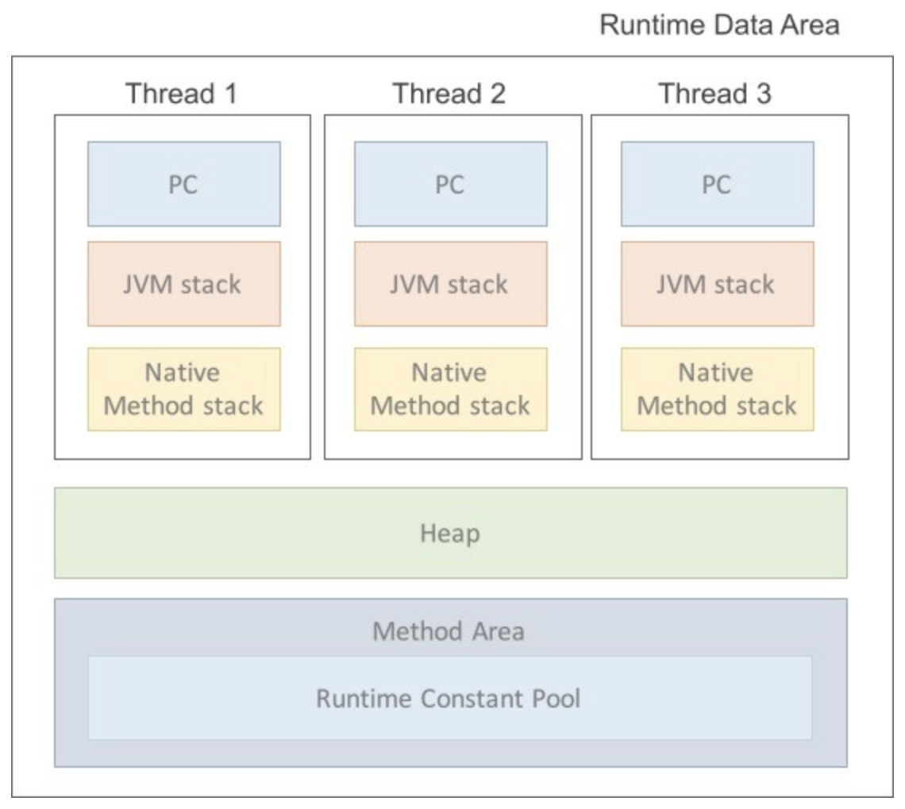
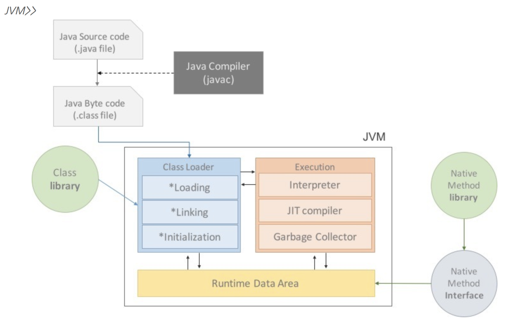

## Basic of JAVA

### index

- JVM (Java Virtual Machine)
- GC (Garbage Collection)
- String, StringBuilder, StringBuffer
- Collection
- Ref

#### JVM (Java Virtual Machine)

프로그램을 실행시키기 위한 물리적 머신과 유사한 머신을 소프트웨어로 구현한 것을 가상 머신이라 부르며, 자바 환경에서 소프트웨어로 구현된 가상 머신을 자바 가상 머신 (JVM, Java Virtual Machine)이라 한다. 자바 어플리케이션을 클래스 로더를 통해 읽어 들여 자바 API와 함께 실행하는 것을 의미하며, 자바 클래스 로더 (Java Class Loader)는 자바 클래스를 자파 가상 머신으로 동적 로드하는 자바 런타입 환경 (JRE, Java Runtime Environment)이다. 자바는 동적을 클래스를 읽어오며 런타임에 모든 코드가 JVM에 링크되낟. 모든 클래스는 그 클래스가 참조되는 순간 동적으로 JVM에게 링크되며 메모리에 적재된다. JVM은 JAVA와 OS 사이에서 중계자 역할을 하며, JAVA가 OS에 구해받지 않고 재사용 할 수 있는 기능을 지원한다. Garbage Collection을 통해 동적으로 할당한 메모리 영역 중 일부 사용하지 않는 영역을 해제하여 메모리를 관리한다. JVM은 스택 기반의 가상 머신이다.

우리가 JVM을 학습하는 이유는 메모리의 효율성을 극대화하기 위해 메모리 구조에 대한 이해가 필요하며, 이를 관리하는 개체를 이해함으로써 속도 저하 현상 또는 튕김 현상 방지 등의 버그 및 에러를 처리하며 효율성을 극대화 시키기 위해서이다.

JVM의 클래스 로더(Class Loader), 실행 엔진( Execution Engine), 런타임 데이터 영역 (Runtime Data Area)으로 크게 3 가지로 구성된다.

- 클래스 로더 (Class Loader)

  클래스 (.class) 파일을 JVM 내로 로드하며, 링크를 통해 배치하는 작업을 수행하는 모듈이다. 런타임 (Runtime) 시점에서 동적으로 클래스를 로딩하며, 클래스의 인스턴스를 생성하면 클래스 로드에 의해 메모리에 로딩된다. Jar 파일 내에 저장된 클래들을 JVM 위에 적재하고, 사용하지 않는 클래스들은 메모리에서 삭제한다.

- 실행 엔진 (Execution Engine)

  클래스 로더가 JVM 내의 런타임 데이터 영역에 바이트 코드 (Byte Code)를 배치시키면 이를 실행 시키는 역할을 한다. 바이트 코드는 기계가 바로 수행할 수 없는 비교적 인간이 보기 편한 형태이며, 실행 엔진은 이를 실제 JVM 내부에세 기계가 실행할 수 있는 형태로 변경한다. JVM은 두 가지 방식을 사용하여 변경한다.

  - Interpreter (인터프리터): 실행 엔진이 자바 바이트 코드를 명령어 단위로 읽어서 실행한다.
  - JIT (Just-In-Time): 인터프리터 방식의 단점을 보완하기 위해 도입된 컴파일러로, 기본적으로는 인터프리터 방식으로 실행하다가 적저란 시점에 바이트 코드 전체를 컬파일하여 네이티브 코드로 변경하여 직접 실행하는 방식이다. 네이트브 코드는 캐시에 보관되기 때문에 한 번 컴파일된 코드는 추가적인 컴파일없이 빠르게 수행된다.

  JIT 컴파일러가 컴파일하는 과정은 바이트 코드를 인터프리팅하는 것보다 오래 걸리기 때문에 한 번만 실행되는 코드라면 컴파일하지 않고 인터프리팅하는 것이 유리하다. 따라서 JIT 컴파일러를 사용하는 JVM은 내부적으로 해당 메서드가 얼마나 자주 수행되는지 체크하며 필요에 따라 컴파일을 수행한다.

- 런타임 데이터 영역 (Runtime Data Area)

  JVM이 프로그램을 수행하기 위해 OS로부터 할당받은 메모리 영역이며, 크게 5 가지 영역으로 구성된다.

  

  - PC Register

    스레드가 시작될 때 생성디며, 각 스레드마다 하나씩 존재한다. 스레드가 어떤 부분에서 어떤 명령으로 실행해야 할 지에 대한 기록을 담당하며, 현재 수행중인 JVM 명령의 주소를 갖는다.

  - JVM Stack

    프로그래머 실행 과정에서 임시로 할당되었다가 메소드를 빠져나가면 소멸되는 특성의 데이터를 저장하기 위한 영역으로, 각종 형태의 변수, 임시 데이터, 스레드, 메소드 정보 등이 담긴다. 메소드 호출시 각 스택 프레임 (메서드만의 공간)이 생성되며, 메서드 수행 종료시 프레인 단위로 삭제된다. 

  - Native Method Stack

    자바 프로그램이 컴파일되어 생성되는 바이트 코드가 아닌 실제 실행할 수 있는 기계어르 작성된 프로그램을 실행시키는 영역으로, Java Native Interface를 통해 바이트 코드로 전환하여 저장된다. 일반적인 프로그램처럼 커널이 스택을 잡아 독자적으로 프로그램을 실행시키는 영역이다.

  - Method Area (Class Area, Static Area)

    클래스 정보를 처음 메모리에 올릴 때 초기화되는 대상을 저장하기 위한 영역으로, 컴파일된 바이트 코드의 대부분이 메소드 바이트 코드이기 때문에 대부분의 바이트 코드가 로딩된다. 내부에 별도로 Runtime Constant Pool이라는 관리 영역이 존재하며 상수 자료형을 저장하여 참조하고 중복을 막는 역할을 수행하며, 해당 영역에 올라가는 정보는 3 가지로 나뉜다.

    - Field Information: 멤버 변수의 이름, 데이터 타입, 접근 제어자에 대한 정보
    - Methdo Information: 메소드의 이름, 리턴 타입, 매개 변수, 접근 제어자에 대한 정보
    - Type Information: Class / Interface 구분 저장, Type 속성, 전체 이름, Super Class의 정보

    Method Area는 클래스를 위한 공간이며, Heap 영역은 객체를 위한 공간이다.

  - Heap Area

    객체를 저장하는 가상 메모리 공간이며, new 연산자로 생성된 객체와 배열이 저장된다. Method Area에 로딩된 클래스만 객체를 생성할 수 있으며, 해당 영역은 세 부분으로 나뉜다.

    

    - Permanent Generation

      생성된 객체 정보의 주소 값이 저장되는 공간으로, 클래스 로더에 의해 로드된 Class, Method 등의 메타 정보 (Meta)가 저장되는 영역이다. Reflection을 사용하여 동적으로 클래스가 로딩되는 경우 사용된다.

    - New / Young Generation

      Eden: 객체가 최초로 생성되는 공간

      Survivor 0/1: Eden에서 참조되는 객체들이 저장되는 공간

    - Tenured Generation (Old)

      New 영역에서 일정 시간 참조되고 있는, 살아남은 객체들의 저장 공간이다. Eden 영여겡 객첵 가득차게 되면, 첫 번째 GC (Minor GC)가 발생한다. Eden 영역에 있는 값을 Survivor 1 영역에 복사하고 이 영역을 제외한 나머지 영역의 객체를 삭제한다. 인스턴스는 소멸 방법과 소멸 시점이 지역 변수와는 다ㄹ기 때무넹 힙이라는 별도의 영역에 할당된다. 자바 가상머신은 합리적으로 인스턴스를 소멸시키며, 더 이상 인스턴스의 존재 이유가 없을 경우 소멸시킨다.

JVM의 전체적인 흐름은 아래와 같다.

- 프로그램이 실행되면 JVM은 OS로부터 해당 프로그램이 필요로 하는 메모리를 할당받는다. 할당 받은 메모리는 JVM이 용도에 따라 여러 영역으로 나누어 관리한다.
- 자바 컴파일러 (Javac)가 자파 소스코드 (.java)를 읽어들여 자바 바이트코드(.class)로 변환시킨다.
- 변환된 자바 바이트 코드 (.class) 파일은 클래스 로더를 통해  JVM으로 로딩된다.
- 로딩된 자바 바이트 코드 (.class) 파일은 실행 엔진 (Execution Engine)을 통해 해석된다.
- 해석된 바이트 코드는 Runtime Data Areas 영역에 배치되어 실질적인 수행이 이루어진다.
- 이러한 과정 속에서 JVM은 주기적으로 Thread Synchronization과 Garbage Collection과 같은 관리 작업을 수행한다.

#### GC (Garbage Collection)

to do

#### Ref

- [자바가상머신, JVM(Java Virtual Machine)이란 무엇인가](http://asfirstalways.tistory.com/158)
- [JVM 이란?](https://medium.com/@lazysoul/jvm-%EC%9D%B4%EB%9E%80-c142b01571f2)

