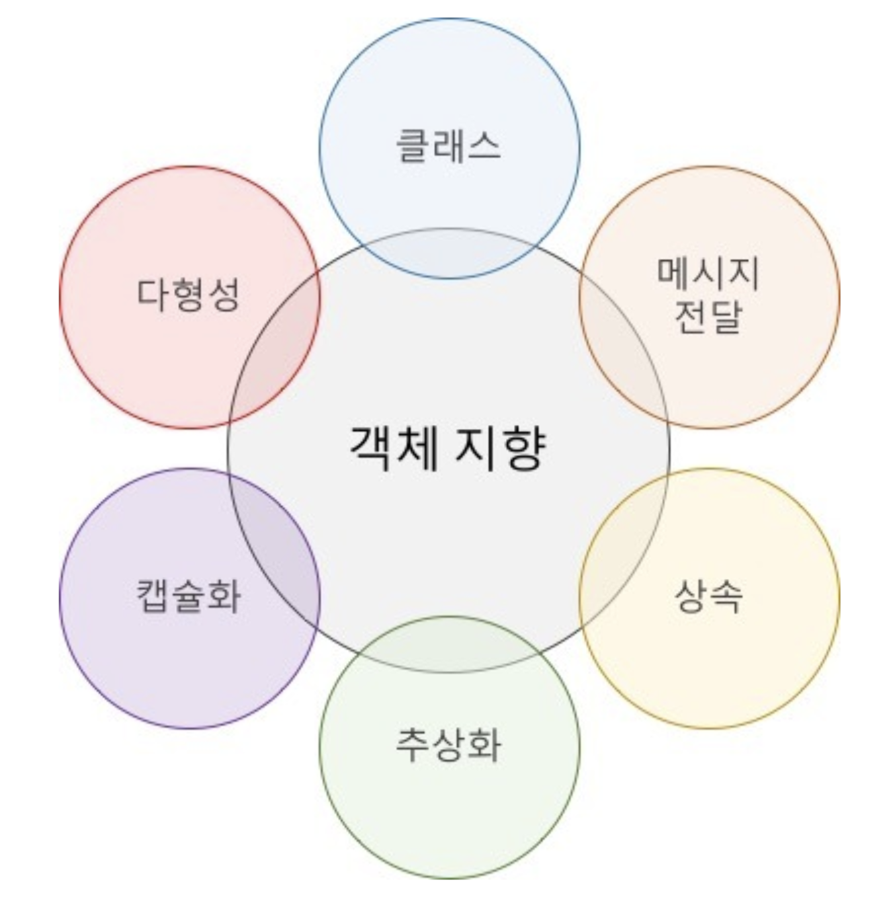
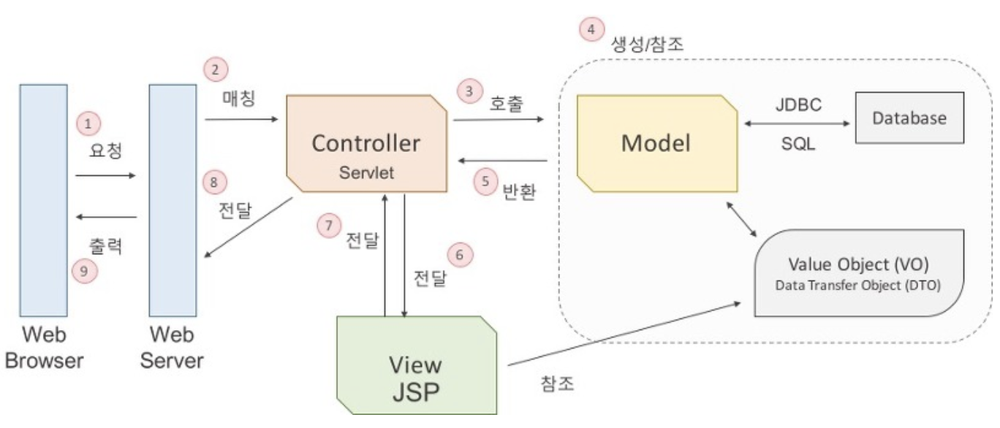

# 개발 관련 기본 상식

### index

- 객체 지향 프로그래밍
- RESTful API
- TDD
- MVC 패턴
- 다형성
- 트랜잭션 (Transaction)
- 메모이제이션 (Memoization)
- Ref


## 객체 지향 프로그래밍 (Object Oriented Programming)

인간 중심적 프로그래밍 패러다임으로, 현실 세계를 프로그래밍을 통해 표현하는 것을 말한다. 현실 세계의 모든 사물들을 객체화하여 프로그래밍함으로써, 다양한 영역에서의 비즈니스 로직을 객체 지향적으로 프로그래밍할 수 있다. 특정 분야에서 객체를 만들고, 객체로부터 개발하고자하는 어플리케이션에 필요한 특징들을 뽑아와 프로그래밍 하는 것을 추상화라 한다.

객체 지향 프로그래밍은 모듈 및 라이브러리화하여 신뢰성 및 재사용성을 향상시키며, 디버깅이 쉽고 유지 보수가 수월하다. 데이터 모델링을 할 때 객체와 매핑함으로써 요구사항을 명확히 파악하여 프로그래밍을 할 수 있어 생산성을 향상시킨다.



**객체 지향의 기본은 객체**이며, 객체의 핵심은 기능을 제공하는 것이다. 실제로 객체를 정의할 때 사용하는 것은 객체가제공행 할 기능이며, 객체가 내부적으로 어떤 데이터를 갖고 있는 지를 정의하지 않는다. 이러한 기능을 **오퍼레이션 (Operation)**이라 한다. 결과적으로 객체는 오퍼레이션으로 정의된다. 오퍼레이션은 3 가지로 구성되며, 이를 **시그니처 (Signature)**라 한다.

- 기능 식별 이름
- 파리미터 및 파라미터 타입
- 결과 값 및 타입

##### 인터페이스와 메시지

객체가 제공하는 모든 오퍼레이션 집합을 객체의 **인터페이스(Interface)**라 부르며, Java에서의 인터페이스와는 상이하다. 객체를 사용하기 위한 명세를 의미한다. 이러한 오퍼레이션의 실행을 요청하는 것이 메시지를 보낸다고 표현한다. 자바에서 메소드를 호출하는 것이 메시지는 보내는 것에 해당한다.

##### 책임

객체마다 자신이 제공할 수 있는 기능에 대한 책임이 있으며, 이 책임은 작으면 작을수록 좋다. 즉 객체가 제공하는 기능의 개수가 적은 것이 좋으며, 책임의 크기가 작을수록 유연성은 향상된다. 이것이 **단일 책임 원칙 (SRP, Single Responsibility Principle)**이라 한다.

##### 의존

한 객체의 코드에서 다른 객체를 생성하거나 다른 객체의 메서드를 호출하는 것의 객체가 다른 객체를 의존한다는 것을 의미 한다. 이렇게 의존의 영향은 꼬리에 꼬리를 문 것과 같다. 한 객체의 변화가 결국 자기 자신의 객체에게로 돌와와 영향을 준다면, 이것을 순환 의존이라 한다. 이를 지양하기 위한 원칙으로 **의존 역전 원칙 (DIP, Dependency Inversion Principle)**이라 한다.

##### 캡슐화

객체 지향의 기본은 캡슐화를 통해 한 곳의 변화가 다른 곳에 미치는 영향을 최소화하는 것이다. **객체가 내부적으로 기능이 어떻게 구현되어 있는지 감추는 것을 캡슐화**라 하며, 기능 구현이 변경되더라도 이를 사용하는 코드는 영향을 받지 않아야 한다. 즉 내부 구현 변경의 유연함을 주는 기법이 캡슐화이다.


## RESTful API

월드 와이드 웹(WWW)과 같은 분산 하이퍼미디어 시스템을 위한 소프트웨어 아키텍처의 한 형시으로 자원을 정의하고 자원에 대한 주소를 지정하는 방법 전반에 대한 패턴이라 한다.

아키텍처 스타일 (Architectural Style)이란, 그 스타일을 따르는 아키텍처가 지켜야하는 제약 조건들의 집합을 의미한다. REST는 네트워크 기반 아키텍처 스타일들 몇가지워 추가로 Uniform Interace 스타일을 함께 결합한 하이브리드 스타일이다.

REST(REpresentational State Transfer)는 2000년도 로이 필딩(Roy Fielding)의 박사 학위 논문에서 최초로 소개된 아키텍처로, 웹의 장점을 최대한 활용할 수 있는 아키텍처를 말한다. 자원(Resource), 행위(Verb), 표현(Representations) 으로 구성되며 REST의 특징 6가지는 아래와 같다.

- Uniform (유니폼 인터페이스)
  - 유니폼 인터페이스는 URI로 지정한 리소스에 대하 조작을 통일하고, 한정된 인터페이스로 수행하는 아키텍처 스타일 의미
- Stateless (무상태성)
  - REST는 무상태성의 특징을 갖으며, 작업을 위한 상태 정보를 따로 저장하고 관리하지 않는다. 세션 또는 쿠키 정보를 별도로 저장하고 관리하지 않기에 서버는 수신된 요청에 대한 응답만 함으로서, 서비스의 자유도를 높이며 서버에서 불필요한 정보의 관리를 배제함으로써 구현 및 개발이 단순해진다.
- Cacheable (캐시)
  - 웹에서 사용하는 기존 인프라를 그대로 활용하며, HTTP가 가진 캐싱 기능을 지원한다. HTTP 프로토콜 표준에서 사용하는 Last-Modified 태그, E-Tag를 이용해 캐싱 기능을 구현할 수 있다.
- Self-Descriptiveness (자체 표현 구조)
  - REST API만 보고도 이를 쉽게 파악할 수 있는 자체 표현 구조로 되어 있다.
- Client - Server 구조
  - REST 서버는 API를 제공하고, 클라이언트는 사용자 인증 및 컨텍스트 (세션, 로그인 정보 등...)를 관리하는 구조를 갖는다. 이는 각자의 영역을 명확히 구분함으로써, 클라이언트와 서버에서 개발해야 할 부분이 명확해지며 서로간의 의존성을 낮출 수 있다.
  - 사용자 인터페이스에 대한 관심 (Concern)을 데이터 저장에 대한 관심으로부터 분리함으로서 클라이언트의 이식성과 서버의 규모확장성을 개선한다.
- 계층적 구조 
  - REST 서버는 다중 계층으로 구성될 수 있으며, 보안, 로드 밸런싱, 암호화 계층을 추가해서 구조상을 유연성을 극대화 시킬 수 잇따.
  - Proxy, 게이트웨이 등의 네트워크 기반의 중간 매체를 사용할 수 있다.

#### REST API를 설계 주의 사항

- URI는 정보의 자원을 표현한다.
- 자원과 행위를 명시적이고 직관적으로 분리한다.
- 자원이 가리키는 것은 명사로 표현되어야 한다.
- 자원에 대한 행위는 HTTP Method (GET, POST, PUT, DELETE)로 표현한다.
- 메시지는 헤더와 바디를 명확히 구분하여 사용한다.


## TDD (Test Driven Development)

TDD란 개발 사이클의 반복에 의존하는 소프트웨어 개발 프로세스이다. 개발자가 요구되는 새로운 기능에 대한 자동화된 테스트 케이스를 작성하고 해당 테스트를 통고하는 가장 간단한 코드를 작성한다. 테스트를 통과하는 코드를 작성하고 상황에 맞게 리펙토링하는 과정을 거치면서, 테스트가 코드 작성을 주도하는 개방 방식을 의미한다. 

#### Add a Test

새로운 기능을 추기하기 전 테스트를 먼저 작성하며, 개발자는 테스트를 작성하기 위해서 새로운 기능이 요구사항과 명세를 정확히 파악해야 한다. 개발자가 코드를 작성하기 전에 요구사항에 집중할 수 있게 하며, 테스트 주도 개발의 이점이라 할 수 있다.

#### Run All Tests and See If New One Fails

새로운 기능을 추가해감에 따라 기존에 잘 동작하던 기능이 제대로 작동하지 않을 가능성이 생기며, 개발자가 이를 인지하지 못하는 경우 더 안좋은 상황에 직면할 수 있다. 이를 방지하기 위해 테스트 코드를 작성하는 것이다. 새로운 기능을 추가하여 테스트 코드를 돌림으로써 새로운 기능과 기존의 기능의 동작을 확인할 수 있다.

#### Refactor code

기존의 코드를 리팩토링하면서 객체 지향 프로그래밍의 원칙에 어긋나는 함수를 나누거나, Code Convention, 네이밍 규칙, 예외 처리 등으로 일부 수정이 된다. 이때 기존의 기능들이 리팩토링을 거치면서 오작동을 일으킬 가능성이 있다. 이를 쉽게 확인하기 위해 기존에 작성한 간단한 테스트 코드를 돌려가면서 좀 더 수월한 리팩토링을 진행 할 수 있다. 결과적으로 리팩토링의 속도는 빨라지고 코드의 퀄리티가 향상하게 된다.


## MVC 패턴

디자인 패턴이란 프로그램이나 어던 특저한 것을 개발하는 중에 발생하는 문제점을 정리해서 상황에 맞게 적용할수 있도록 정리함으로써, 특정한 규약으로 만들어 놓은 형태를 의미한다. 특정한 상황과 문제가 주어지면 이를 더 쉽고 효율적으로 구현할 수 있게 만든 패턴이며, 이 중 하나가 MVC 패턴이다.

MVC 패턴이란, 하나의 웹 어플리케이션을 Model, View, Controller 영역으로 구분하고 비즈니스 로직과 프리젠테이션로직으로 분리함으로써, 각자의 영역에 더 집중하여 개발 할 수 있도록 구성된 패턴이다. MVC 모델 1과 MVC 모델 2가 있으며 기본적으로 MVC라하면 MVC 모델 2를 의미한다. MVC 패턴은 개발 초기의 부하가 높고 아키텍처에 대한 수준 높은 이해가 필요하지만, 재사용성 및 확장성에 용이하다. 

- Controller

  일종의 조정자이며,  모델과 뷰 영역 사이에서 흐름을 관리하는 역할을 한다. 사용자의 요청을 받아 이를 수행하기 위한 비즈니스 로직을 선택하여 호출하고, 해당 비즈니스 로직의 결과를 뷰에게 전달한다. 클라이언트가 보낸 데이터가 있다면, 모델에게 전달히기 쉽게 데이터를 가공하고, 모델에서 전달받은 결과를 뷰에게 전달한다.


- View

  클라이언트에게 보여줄 프리젠테이션 로직을 담당하는 영역으로, 컨트롤러로부터 받은 모델의 결과 값을 클라이언트에게 출력할 화면으로 만드는 역할을 담당한다. 대부분 웹 브라우저를 통해 출력하게 되며, 데이터, 텍스트, 입력 폼 등의 클라이언트와의 상호작용을 위한 인트페이스를 표시하는 영역이다.

- Model

  컨트롤러의 호출에 따라 요청에 맞는 역할을 수행한다. 비즈니스 로직에 따라 데이터를 처리하며, 데이터베이스와 연결하여 데이터를 삽입, 삭제, 수정하는 등의 역할을 한다. 

#### MVC 구동 원리



- 웹 브라우저가 웹 서버에 웹 어플리케이션 실행을 요청한다.
- 웹 서버는 들어온 요청을 처리할 수 있는 서블릿을 찾아서 요청을 전달한다.
- 서블릿은 모델 자바 객체의 메서드를 호출한다.
- 데이터를 가공하여 값 객체를 생성하거나, JDBC를 사용해서 데이터베이스와의 인터렉션을 통해 값 객체를 생성한다.
- 업무 수행을 마친 결과 값을 컨트롤러에게 반환한다.
- 컨트롤러는 모델로부터 받은 결고 값을 뷰에게 전달한다.
- JSP는 전달받은 값을 참조하여 출력할 결과 화면을 만들고 컨트롤러에게 전달한다.
- 뷰로부터 받은 화면을 웹 서버에게 전달한다.
- 웹 브라우저는 웹 서버로부터 요청한 결과 값을 응답받아, 그 값을 화면에 출력한다.


#### 다형성 (Polymorphis)

상속을 통해 기능을 확장하거나 변경하는 것을 말하며, 객체나 인터페이스, 추상과 같이 철학적인 느낌을 자아내는 용어이다. 다형성에는 오버라이딩 (Overriding)과 오버로딩 (Overloading)이 대표적이다.

- 오버라이딩 (Overriding)

  상위 클래스를 상속받은 하위 클래스에서 상위 클래스의 (추상)메소드를 같은 이름, 같은 반환 값, 같은 파라미터로 메소드 내의 로직들을 새롭게 정의한 것을 의미한다. 하나의 상위 클래스를 상속받은 복수 개의 하위 클래스들이 같은 이름에 다른 기능을 하는 메소드를 정의하고 사용할 수 있다.

- 오버로딩 (Overloading)

  하나의 클래스에서 같은 이름의 메소드를 복수 개로 가질 수 있게 한다. 메소드의 파라미터 타입과 갯수 또는 메소드의 반환 타입을 다르게 하여, 유사한 일을 수행하면서 인자만 다른 메소드에 대해 같은 이름을 사용한다.

오버로딩은 대상이 되는 함수를 컴파일 시점에서 지정하고, 오버라이딩은 런타임 시점에서 정의한다.


### 트랜잭션 (Transaction)

하나의 작업 단위를 의미한다. 어떤 비즈니스 로직에서 몇 가지 작어 중 하나라도 실패한다면, 작업이 시작되기 바로 직전으로 되돌아가는 것을 롤백 (Rollback)이라 하며, 이는 예외 처리를 통해 처리할 수 있다.


### 메모이제이션 (Memoization)

메모이제이션은 컴퓨터 프로그램이 동일한 계산을 반복해야 할 때, 이전에 계산한 값을 메모리에 저장함으로써 동일한 계산의 반복 수행을 제거하여 프로그램 실행 속도를 빠르게 하는 기술을 말한다. 동적 계획법의 핵심이 되는 기술이며, 재귀 호출시에 이를 사용하면 유용하다. 반복적으로 계산되는 연산의 횟수를 이전의 값들을 재사용함으로써 크게 줄일 수 있따.

대표적인 예로 피보나치 수열에 접목함으로써 불필요한 연산을 피할 수 있다. 메모이제이션이 접목되지 않는 피보나치 수열의 코드는 아래와 같다.

```java
fib(n){
  if n is 1 or 2, return 1;
  retur fib(n - 1) + fib(n - 2);
}
```

이때 fib 함수가 재귀적으로 실행되면서 같은 인자 값에 대해 계속해서 반복됨으로, 전체 실행 시간은 [Ω](https://ko.wikipedia.org/wiki/%EC%A0%90%EA%B7%BC_%ED%91%9C%EA%B8%B0%EB%B2%95)(1.6n) 이다. 그러나 fib(n)의 값을 계산하고 저장하여 (Memoize) 재사용함으로써 실행 시간을 [Θ](https://ko.wikipedia.org/wiki/%EC%A0%90%EA%B7%BC_%ED%91%9C%EA%B8%B0%EB%B2%95)(n)으로 줄일 수 있다. 

```java
allocate array for memo, setting all entries to zero;
initialize memo[1] and memo[2] to 1;

fib(n) {
   if memo[n] is zero:
       memo[n] = fib(n-1) + fib(n-2);
   return memo[n];
}
```


#### Ref

- [객체 지향에 대한 이해 / 객체 지향적 설계](http://asfirstalways.tistory.com/177)
- [Part 1-1 Development common sense](https://github.com/JaeYeopHan/Interview_Question_for_Beginner/tree/master/Development_common_sense#object-oriented-programming)
- [RESTful API](http://meetup.toast.com/posts/92)
- [바쁜 개발자들을 위한 REST 논문요약](https://blog.npcode.com/2017/03/02/%EB%B0%94%EC%81%9C-%EA%B0%9C%EB%B0%9C%EC%9E%90%EB%93%A4%EC%9D%84-%EC%9C%84%ED%95%9C-rest-%EB%85%BC%EB%AC%B8-%EC%9A%94%EC%95%BD/)
- [MVC 패턴이란](https://m.blog.naver.com/PostView.nhn?blogId=jhc9639&logNo=220967034588&proxyReferer=https%3A%2F%2Fwww.google.co.kr%2F)
- [MVC 모델(패턴)이란?](http://blog.daum.net/gunsu0j/165)
- [메모이제이션](https://ko.wikipedia.org/wiki/%EB%A9%94%EB%AA%A8%EC%9D%B4%EC%A0%9C%EC%9D%B4%EC%85%98)
